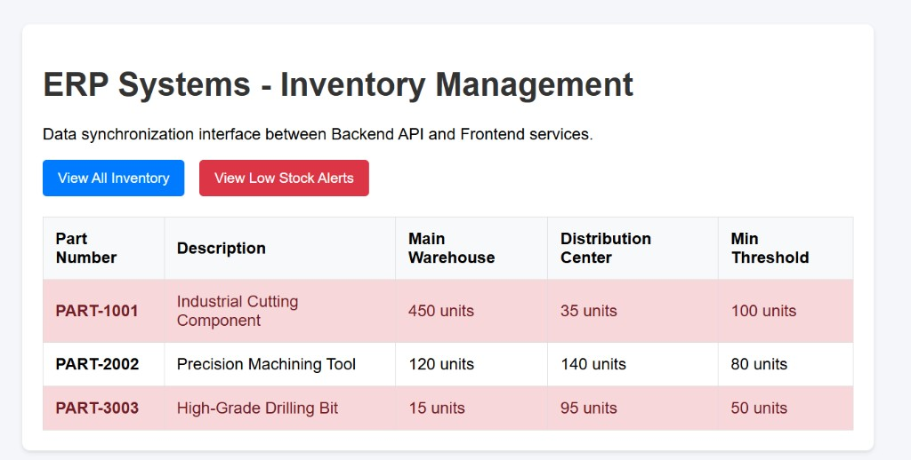
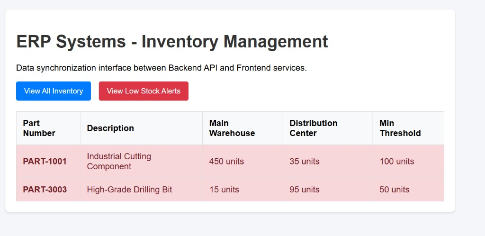

# Enterprise ERP - Inventory Management Dashboard

A high-performance, full-stack inventory tracking dashboard demonstrating a modern **decoupled Client-Server architecture**. The system utilizes a native, lightweight PHP Backend API and a modular, event-driven vanilla JavaScript Frontend.

## ⚙️ System Architecture & Design
The project is built around the core software engineering principle of **Separation of Concerns (SoC)**, dividing the application into distinct logical layers:

1. **Backend Layer (`api.php`):** Actively acts as an enterprise RESTful API endpoint. It manages Cross-Origin Resource Sharing (CORS) headers to ensure secure browser interactions and parses dynamic HTTP GET query parameters (`?filter=low_stock`) to perform fast, server-side array filtering.
2. **Structure Layer (`index.html`):** A clean, semantic HTML5 foundation completely stripped of inline styles and scripting, focusing purely on accessible DOM structuring.
3. **Style Layer (`style.css`):** An independent, scalable stylesheet handling the responsive layout, typography, and visual alert states without cluttering the structural code.
4. **Logic Layer (`script.js`):** The engine of the client interface. Driven by asynchronous JavaScript (ES6+), it utilizes the native `Fetch API` to non-blockingy consume the JSON payload from the server, clear stale views, evaluate custom threshold rules, and map objects dynamically into the view.

---

## 📸 Interface Preview

### 1. Global Inventory Monitor (Default View)
Displays real-time stock levels across global enterprise logistics channels.


### 2. Low Stock Alerts (Filtered Server Response)
Leverages server-side parameters to instantly isolate components dipping below critical operational thresholds.


---

## 🛠️ Tech Stack & Protocols
- **Backend Environment:** PHP 8.2+ (CLI Native Execution)
- **Frontend Architecture:** Vanilla HTML5 / Modern CSS3 (Variables & Reset principles)
- **Data Exchange Format:** JavaScript Object Notation (JSON) via asynchronous HTTP requests
- **Server-Client Handshake:** Cross-Origin Resource Sharing (CORS) compliance headers

---

## 💻 Local Implementation & Deployment

Follow these streamlined operations to get the global dashboard running on your local machine:

### Prerequisite
Ensure your local environment configuration includes a globally mapped **PHP 8.2+** engine. Verify execution using terminal runtime arguments:
```bash
php -v